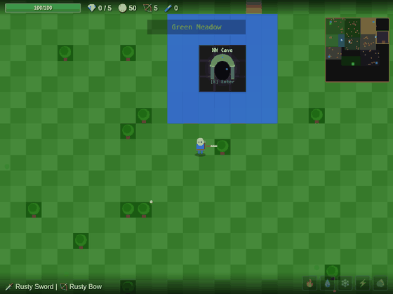
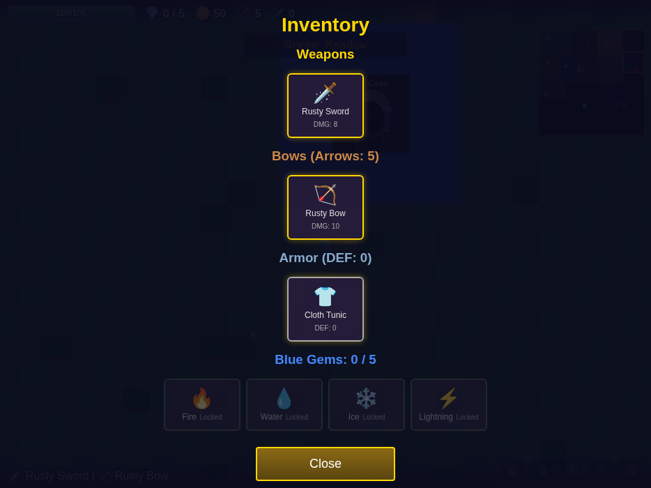
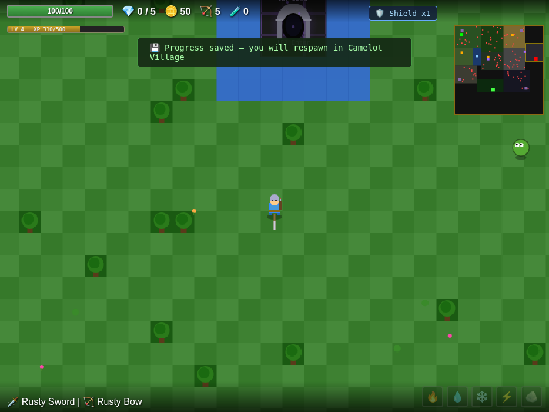
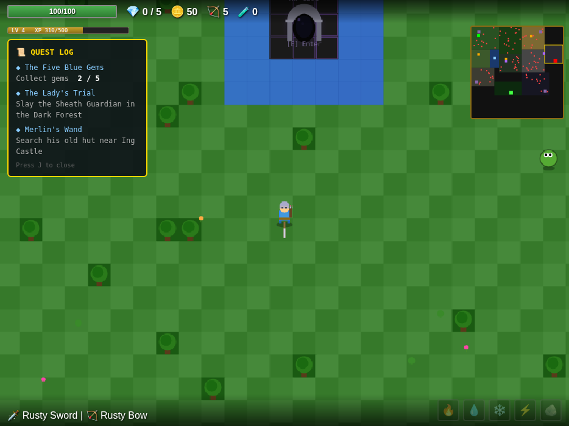
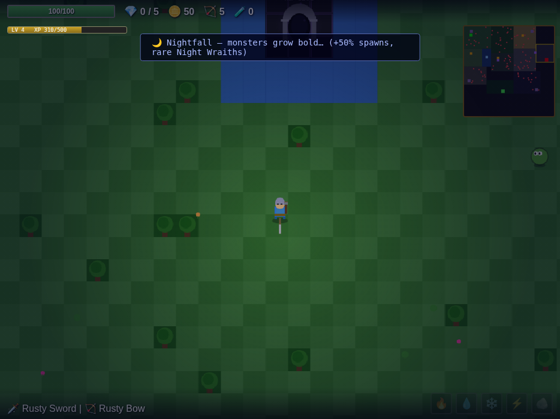
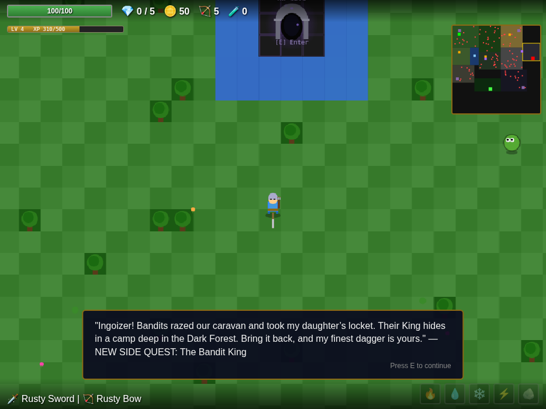
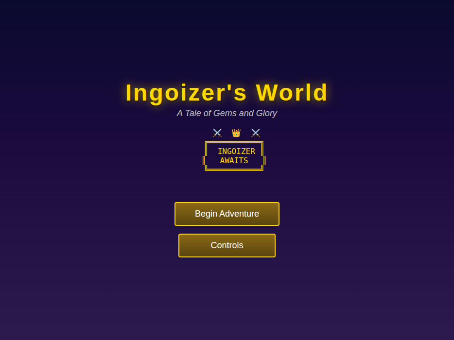
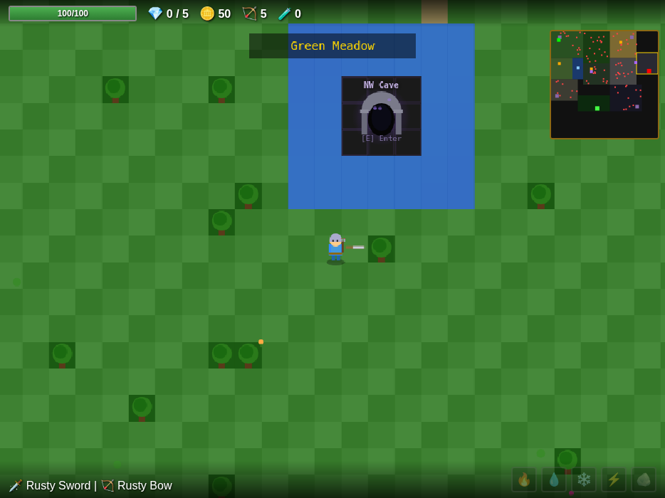
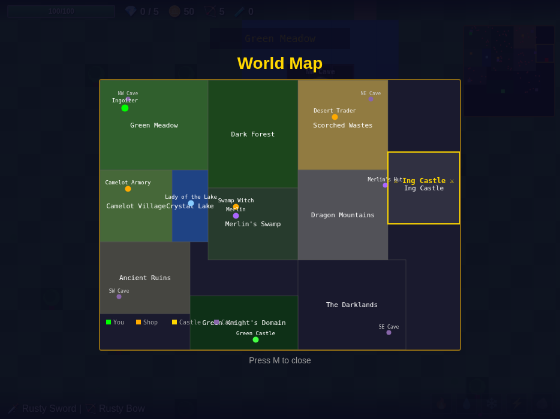

# Ingoizer's World — Full Project Review & Recommendations

*Review date: July 2026 · Codebase: ~11,400 lines of vanilla JS across 9 modules*

The game is in great shape overall: a complete quest loop (5 gems → Black Knight → Greenlands → Green Knight), 4 caves with two dungeon styles, enchanting, riddles, shops with buy/sell, and solid mobile support. The findings below are organized so you can pick what goes into the next update. Nothing has been changed in the game code — this is review only.

---

## 1. Bugs found (priority ordered)

### 🔴 P0 — progression-breaking

**1.1 Killing a boss with Water or Ice power never registers the kill**
`js/combat.js:178-185` (water) and `202-209` (ice) call `boss.takeDamage(...)` / `greenKnight.takeDamage(...)` but never push the result into `results`, unlike the fire/earth/lightning branches. If the finishing blow on the Black Knight comes from Water or Ice, `onEntityKilled` never fires: no Dark Crest, **Greenlands never unlocks**, the boss health bar stays stuck on screen, and the victory sequence never plays. Same failure for the Green Knight (no Magic Charm, no victory screen) and for cave bosses (no Purple Gems).
*Fix: capture `killed` and push `{ target, damage, killed, isBoss: true }` exactly as the fire/earth branches do.*

**1.2 Excalibur can become permanently unobtainable**
The Sheath Guardian troll spawns in the Dark Forest at game start and aggros anyone within 120px (`js/game.js:1004-1024`). If the player kills it *before* meeting the Lady of the Lake, `hasSheath` is set but the quest state stays `"none"` (`js/game.js:773-782` only advances the state if it is already `"given"`). Talking to the Lady afterwards moves the state to `"given"` — which can never reach `"sheath_acquired"` because the troll is already dead. Excalibur is locked out for the entire run.
*Fix: in `startLadyQuest`, if `player.hasSheath` is true, jump straight to the reward branch; also set the state in `onEntityKilled` unconditionally.*

### 🟠 P1 — crashes and wrong information

**1.3 `CAVE_GAUNTLET` is referenced but never defined**
Used in `js/entities.js:130` and `js/ui.js:595, 644, 720-722`, but the constant doesn't exist in `constants.js`. Today `hasGauntlet` is never set to true so the code is dormant, but the moment the drop is wired up (the comment says "Cave boss drop: +4 damage") the game crashes with a `ReferenceError` when shooting a bow or opening the inventory. Also inconsistent: `getWeapon()` hardcodes `+4` (`entities.js:101`) while `getBow()` uses the undefined constant. This looks like a half-shipped item — either finish it (define the constant, have a cave boss drop it) or delete the leftovers.

**1.4 Earth power is missing from the inventory**
`js/ui.js:729` lists only `["fire", "water", "ice", "lightning"]`. Players browsing the inventory see 4 of 5 powers and can't activate Earth from there (screenshot below — Earth is absent from the bottom row).

**1.5 Armor DEF display double-counts gem bonuses**
`js/ui.js:614` computes `player.getArmor().defense + GREEN_GEM_DEFENSE.bonus` — but `getArmor()` already includes the Green Gem (and Purple Gem) bonus, so the inventory header shows inflated defense once the Green Gem of Fortitude is collected.

### 🟡 P2 — polish and consistency

| # | Issue | Where |
|---|-------|-------|
| 1.6 | `checkPlayerAttack` uses `return hits` instead of skipping the block when the boss was already hit this swing — silently skips the Green Knight check. Harmless today (bosses never coexist) but a trap for future content. | `js/combat.js:63, 95` |
| 1.7 | `locked: true` on the Greenlands zone is never enforced — players can wander into an empty, unexplained zone before the unlock, and the Green Knight's Castle is labeled on the world map from minute one (spoiler). | `js/constants.js:27`, world map |
| 1.8 | Ice slow and Earth stun have no effect on any boss (bosses have no `slowTimer` handling), so 2 of 5 elements lose their signature effect in the fights that matter most. Suggest 50% effect instead of immunity. | `js/entities.js` Boss/GreenKnight |
| 1.9 | Monster respawn is extremely slow: 2% chance per 5s per type/zone (`MONSTER_SPAWN_RATE = 0.02`) ≈ one respawn per ~4 minutes per type. Since 2 of the 5 Blue Gems must come from monster drops, gem hunting can feel like an empty world. | `js/constants.js:195` |
| 1.10 | Every monster has an `xp` stat that is never used — no XP counter, no leveling. Dead data or a missing feature (see §2.2). | `js/constants.js`, `js/entities.js` |
| 1.11 | Shield Rune has no HUD indicator (just a faint aura), and re-buying while active resets to 1 hit — wasted gold with no warning. | `js/ui.js` buyItem |
| 1.12 | Cave monsters can spawn inside sealed pockets of the cellular-automata boss caves (unreachable/wasted spawns). | `js/world.js:1789+` |
| 1.13 | Riddle shuffle uses `sort(() => Math.random() - 0.5)` — a biased shuffle. Cosmetic. | `js/game.js:1441` |
| 1.14 | World-map zone labels overlap ("Camelot Village/Crystal Lake" collide). | world map render |

---

## 2. Recommended game updates (ranked by impact)

**2.1 Save system + death checkpoint — the single biggest QoL win.**
Right now death throws away the entire run (back to title, new world). Auto-save to `localStorage` after quest milestones/boss kills, and on death respawn in Camelot Village with a small gold penalty instead of a full wipe. Mockup:

*(also shows the proposed Shield HUD pip from 1.11)*

**2.2 XP & leveling — the data already exists.**
Every monster already has an `xp` value; it just isn't awarded. Add an XP bar + level badge: each level grants +5 max HP and +1 damage. Gives moment-to-moment kills a purpose beyond gold, and softens difficulty for younger/casual players without touching boss tuning.

**2.3 Quest log panel (J key / mobile button).**
Three quest lines (gems, Lady, Merlin) plus caves and the fountain are easy to lose track of — especially after a break. Mockup of both 2.2 and 2.3 in-game:

**2.4 Day/night cycle.**
A ~4-minute cycle with a darkness tint at night, +50% spawn rate, and a rare night-only monster ("Night Wraith", better drops). Cheap to build (one overlay + spawn multiplier) and adds rhythm and risk/reward to exploring:

**2.5 Combat feel improvements.**
- Hold-to-attack: holding Space/ATK auto-swings on cooldown (mobile mashing is tiring).
- Boss slow/stun resistance at 50% instead of full immunity (fixes 1.8).
- Faster respawns near un-collected gem objectives (fixes 1.9).

**2.6 Gold sinks for the late game.**
Gold piles up once gear is bought. Ideas: quiver upgrades (+10 max arrow capacity), a "potion belt" (raise potion cap), and a Camelot banker who sells the missing `hunters_bow`-tier cosmetics or map markers.

---

## 3. Story improvements

The Merlin's Hut lore library is a genuinely nice touch — these build on it:

- **Name the Black Knight.** The lore says "none know his true name" — pay that off. Reveal (via a 9th lore page or pre-fight dialog) that he is **Sir Mordain, the fallen First Knight of Ing Castle**, corrupted when he tried to claim all five gems himself. It turns the final fight into a tragedy instead of a generic villain.
- **Frame the Green Knight as an honor duel**, in the spirit of the Arthurian legend: he doesn't want to destroy the realm — he tests its champion. Change his intro line to offer a formal challenge, and his defeat dialog to a bow of respect. Zero new mechanics, much better ending tone.
- **Villager NPCs in Camelot** (3–4 one-line NPCs): make the village feel alive and use them to deliver hints that currently live nowhere ("They say each cave fears a different element…", "The fountain moves with the seasons…").
- **Explain the caves and Purple Gems.** They're the only major content with no lore entry — add 1–2 pages to Merlin's collection ("The Hollow Places").
- **Epilogue screen** after the Green Knight: deeds recap (monsters slain, gems, quests completed, riddles answered) instead of only the monsters-killed count.

---

## 4. New quest ideas

| Quest | Giver / Location | Flow | Reward |
|-------|------------------|------|--------|
| **The Bandit King** | Injured merchant on the meadow road | Clear a bandit camp in the Dark Forest, mini-boss "Bandit King" | **Swift Dagger** (fast/low-dmg weapon — a niche the arsenal is missing) |
| **The Missing Caravan** | Desert Trader | Find 3 scattered caravan crates in the Scorched Wastes | Permanent 15% shop discount |
| **Witch's Brew** | Swamp Witch | Gather 5 glowing mushrooms found only in the caves | Auto-potion charm (drinks a potion automatically at 25% HP) |
| **The Dragon Egg** | Nest in Dragon Mountains | Return a stolen egg past Dragon Whelp patrols (no-combat stealth flavor) | **Dragonscale Shield** — shield charge regenerates every 3 min |
| **Fountain Pilgrim** | Fountain of Youth | Meta-quest: answer 10 riddles total across visits | +20 max HP ("Wisdom of the Waters") |
| **Arena of Camelot** | New arena building in the village | Post-game wave-survival mode using existing monsters | Gold + bragging-rights best-wave counter |

Mockup of side-quest delivery through the existing dialog system:

---

## 5. Suggested release plan

- **v1 — Bug-fix patch (small, ship first):** 1.1, 1.2, 1.3, 1.4, 1.5 — all are sub-20-line fixes.
- **v2 — Quality of life:** save system, XP/leveling, quest log, shield pip, hold-to-attack, respawn tuning.
- **v3 — Content drop:** The Bandit King quest, Camelot villagers, Black Knight backstory + epilogue, day/night cycle.

---

## Appendix — current-state captures

| | |
|---|---|
|  |  |
|  |  |

*Side note: the difficulty-3 NW Cave entrance (water ring) sits directly beside the new-player spawn in Green Meadow — consider swapping it with the difficulty-1 SW cave so the first cave a player meets is the one they can eventually enter first.*
