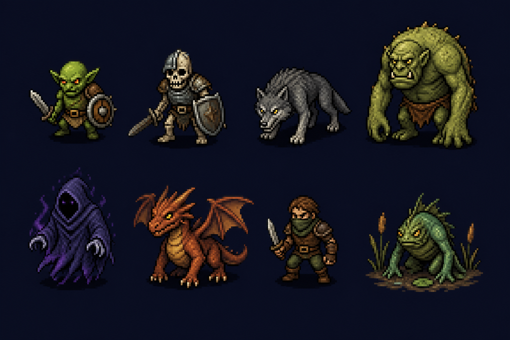
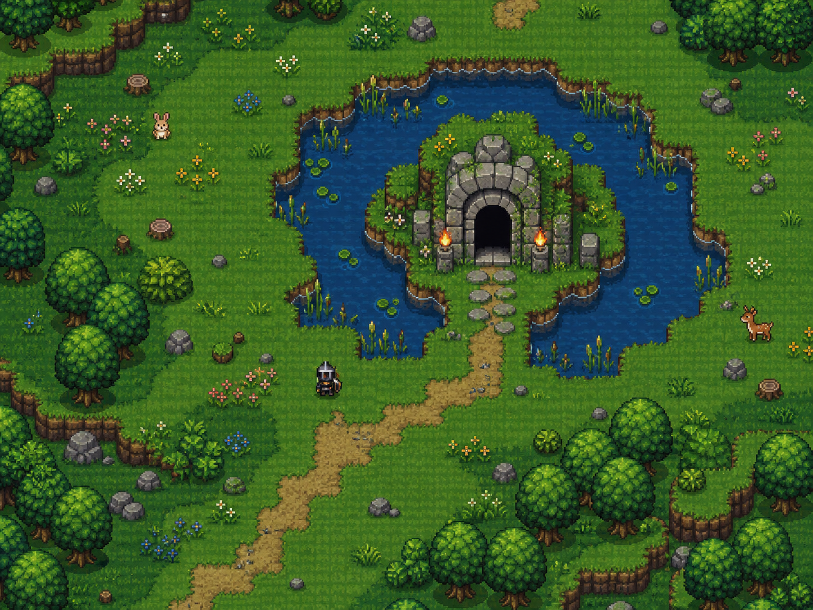
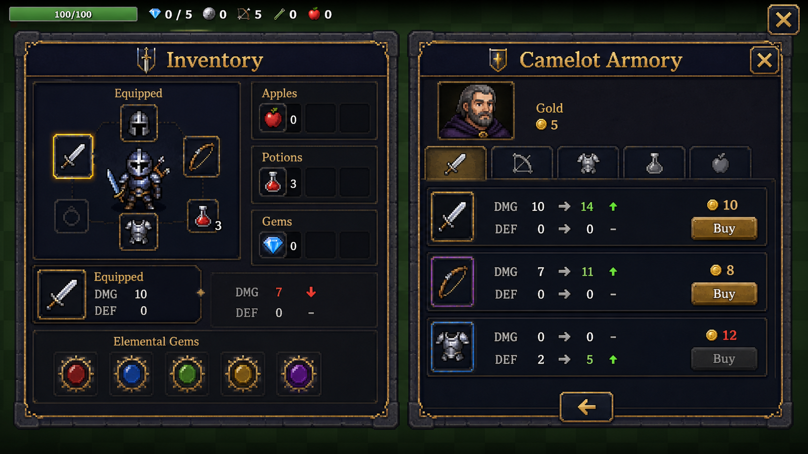
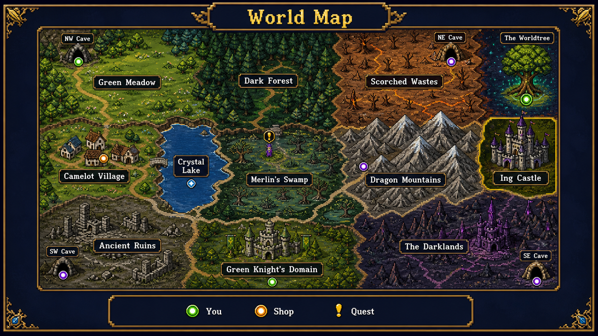
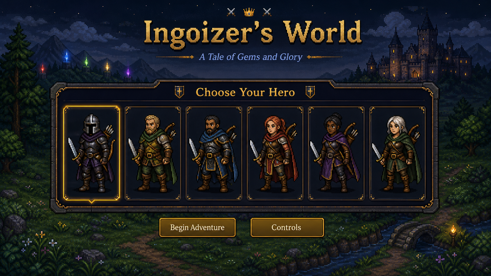
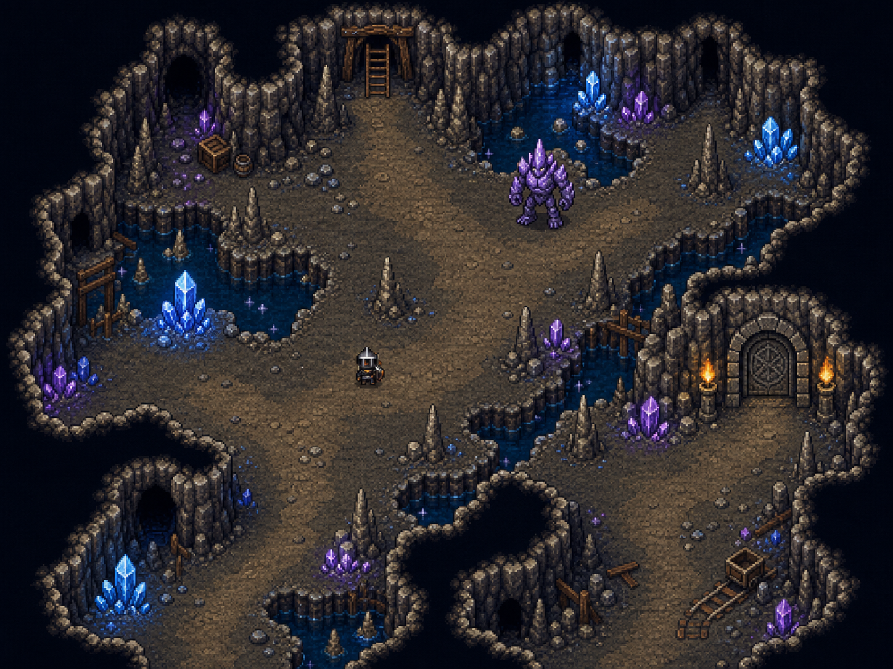
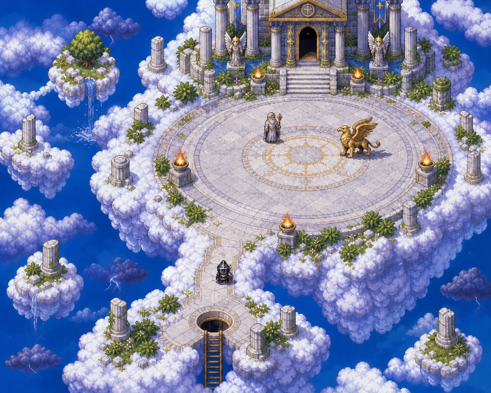
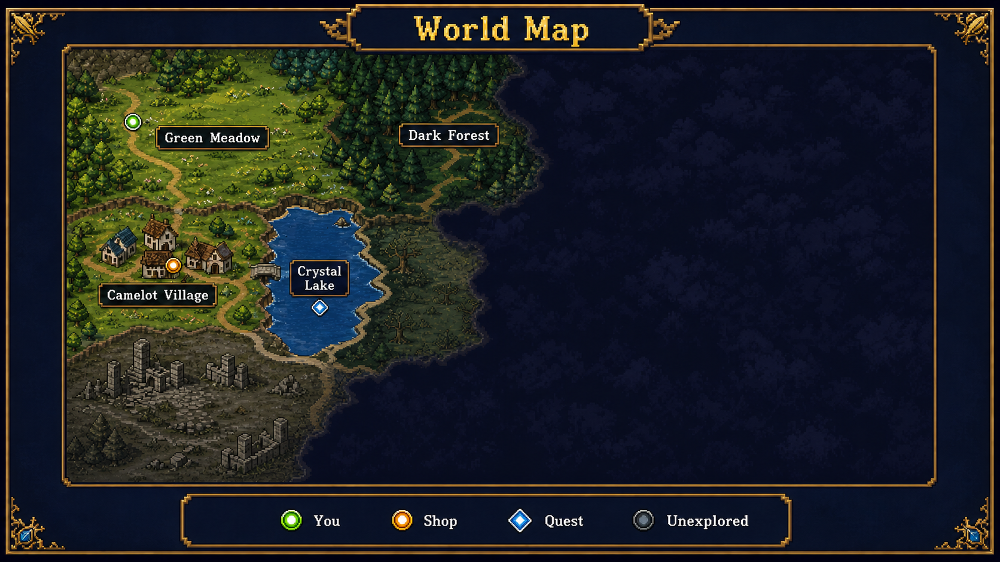
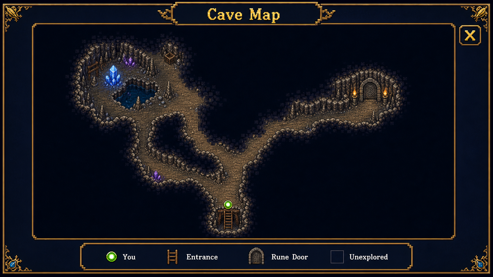
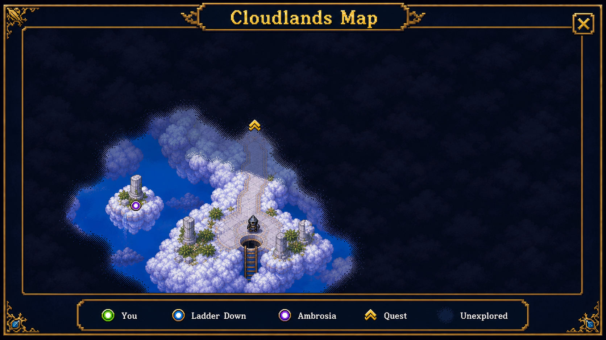

# Ingoizer's World — Visual & Game-Design Review

Review date: August 2026  
Scope: deployed game, desktop/compact landscape layouts, repository implementation, rendering pipeline, overworld, caves, Cloudlands, hostile and friendly entities, bosses, HUD, map, inventory, shops, lore, riddles, and controls.

## Executive verdict

Ingoizer's World already has a charming, generous adventure-game heart. It offers a large explorable world, five elemental powers, melee and ranged combat, shops, equipment, companions, caves, riddles, secrets, multiple boss arcs, and a particularly memorable Olympian encounter. The game is mechanically much richer than its first screenshot suggests.

The largest quality gap is not content. It is visual authorship and consistency.

The new Ingoizer sprite, friendly animals, and Olympians communicate identity through anatomy, pose, material, and motion. Most hostile creatures still share one circular body with eyes and a small identifying attachment. Much of the overworld similarly uses flat colored squares plus simple geometric symbols. The game's best art says "storybook pixel adventure" while the least-developed art says "debug visualization."

The recommended direction is therefore evolutionary, not a wholesale redesign:

> Keep the compact proportions, warmth, humor, readable colors, top-down camera, and welcoming Arthurian tone. Replace generic geometry and emoji with authored silhouettes, small controlled palettes, grid-aligned pixel clusters, and biome-specific material detail.

## What should be protected

- The game is instantly approachable. It does not look grim, cynical, or intimidating.
- Ingoizer's compact armored silhouette is distinctive and fits the playfield.
- Friendly animals have recognizable anatomy, small personality motions, and charming expressions.
- The Olympians have strong presentation, aura, color coding, attack identity, and spectacle.
- Element colors are consistent across HUD, attacks, gems, and effects.
- Gold on deep navy gives the menus a recognizable Arthurian identity.
- The canvas remains highly legible despite a large number of game systems.
- The procedural soundscape and responsive hit feedback give combat more energy than the visuals alone imply.

These are the style anchors. New work should match their spirit, not replace it with realistic or grim fantasy art.

## The core visual problem

The base hostile renderer draws every normal enemy as the same colored circle with the same pair of eyes, then adds one small identifier. A skeleton is a circle with a helmet; a troll is a larger circle with horns; a wolf is a circle with ears; a dragon is a circle with wings. Color and size do most of the communication.

This creates four problems:

1. **Identity:** names promise a creature that the silhouette does not deliver.
2. **Combat readability:** players cannot identify speed, reach, or threat from posture.
3. **World credibility:** enemies feel placed on the map rather than native to their biomes.
4. **Quality mismatch:** Ingoizer and the animals make the generic monsters look more primitive than they did before those upgrades.

The fix is not simply "more pixels." It is to give every entity a silhouette, stance, locomotion, attack anticipation, and material story.

## Art-direction pillars

### 1. Silhouette before surface detail

At gameplay zoom and in grayscale, a player should distinguish a troll, wolf, skeleton, bandit, wraith, and dragon without labels or color.

### 2. Pixel clusters, not smooth primitives

Circles and ellipses are useful construction tools, but the final contour should look intentionally pixel-authored. Use stepped diagonals, clustered shadows, and hard one-pixel highlights. Avoid anti-aliased edges and subpixel placement.

### 3. Three-value readability

Every sprite needs a clear darkest outline/shadow, dominant mid-tone, and controlled light plane. Additional hues are accents, not substitutes for form.

### 4. Material-specific light

- Metal: narrow bright highlights, cool mid-tones, dark contact seams.
- Fur: broken contour clusters and warm/cool patches, not noisy individual hairs.
- Scales: a few directional plates and hard highlights.
- Bone: warm ivory, darker joints, no pure-white body mass.
- Cloth: broad folds and restrained highlights.
- Stone/crystal: planar facets and sharp value changes.

### 5. Charm through proportion and motion

Keep heads and hands slightly oversized, attacks readable, and idle poses expressive. A troll can be cute-adjacent without becoming harmless: heavy jaw, long arms, huge hands, hunched shoulders, and a slow weight shift provide both personality and threat.

### 6. Detail density follows importance

The player, bosses, landmarks, and interactable objects get the most contrast and detail. Traversable ground gets texture without clutter. Background decorations stay lower contrast than hazards and pickups.

## Whole-game review

### Title and controls

**Current strengths**

- Title, subtitle, and primary action are immediately understandable.
- The controls screen is one of the clearest parts of the UI.
- The gold/navy palette is memorable and consistent.

**Recommended improvements**

- Replace the emoji swords/crown and ASCII box with a small authored crest: Ingoizer's visor, crossed sword and bow, and one blue gem.
- Add a restrained pixel-art vignette behind the title—castle silhouette, meadow horizon, or five faint gem constellations—while preserving negative space.
- Use one bitmap display family for titles and one highly readable bitmap family for body copy. The current mixed web-font/emoji/monospace presentation does not yet feel like one designed system.
- Add a tiny animated idle sprite or torch flicker. One memorable motion is enough.

### Ingoizer

Ingoizer is the correct foundation. The hand-authored rows, limited palette, directional frames, crisp integer scaling, caching, quiver layering, and foot alignment form a sensible sprite pipeline.

Next steps:

- Keep the current 14×17 logical-pixel scale as the small-character baseline.
- Add two-frame idle breathing, one attack anticipation frame, one impact/recovery frame, a hurt frame, and a short death/fall sequence.
- Give weapon families unique held silhouettes. The current line-rendered sword, mace, axe, and spear do not fully express the quality of the body sprite.
- Show equipped armor through palette/accessory swaps rather than redrawing the complete player for every item.
- Reserve glow for magic. Mundane equipment should read by form and material.

### Friendly animals

The animals are a successful benchmark because each has:

- distinct anatomy and silhouette;
- motion appropriate to the species;
- face direction and attack movement;
- small secondary animation such as tail, hop, wing, or float;
- color accents and readable ground contact.

Keep them largely as they are. A later polish pass could convert their smooth ellipses into crisper pixel clusters, but their design logic is already correct.

### Olympians and Cloudlands

The Olympian encounter is the most authored piece of the game. The form-cycling premise, name/emblem presentation, aura, robe color, distinctive attacks, and final Zeus escalation create a strong boss identity. Cloudlands also uses layered passes and scalloped silhouettes, making it feel more intentionally composed than most surface biomes.

Recommended refinements:

- Give each god one body-shape or accessory change in addition to palette/emblem changes.
- Replace emoji emblems with compact pixel symbols.
- Keep the current attack choreography and aura language.
- Use Cloudlands' layered construction as the model for overworld terrain transitions.

### Main hostile roster

The first production art milestone should replace the common circular base renderer.

| Enemy | Required silhouette | Motion identity | Material/accent |
|---|---|---|---|
| Goblin | Short, triangular ears, forward head, bent knees, shield/knife asymmetry | Quick scuttle and nervous idle | Green skin, patched brown leather |
| Skeleton Knight | Visible rib cage and limb gaps, helmet, shield | Stiff clattering stride; shield recoil | Warm bone, oxidized iron |
| Dire Wolf | Horizontal quadruped, low head, raised shoulders, tail | Lope, crouch, pounce anticipation | Two-value gray fur, bright eyes |
| Cave Troll | Tall hunch, very long arms, heavy jaw, oversized hands/feet | Slow weighted walk, overhead slam windup | Mossy skin, warts, stone/wood club |
| Dark Wraith | Hood opening, tapering torn robes, no feet | Float, cloth trail, compress before dash | Deep indigo, violet edge light |
| Dragon Whelp | Reptile head, wings, tail, claws | Four-legged scamper, wing flare, breath inhale | Rust-red scales, amber belly |
| Bandit | Human stance, scarf/hood, weapon hand | Sidestep, quick strike, retreat | Earth cloth, muted metal |
| Swamp Creature | Squat amphibian body, webbed limbs, dorsal reeds/spines | Low hop, tongue/claw tell | Muddy green, wet highlight |

The Sheath Guardian should be a stronger, jewel-marked variant of the same troll family—not another unrelated silhouette.

### Greenlands and cave enemies

- Green Guardian: use a humanoid bark-and-brass knight silhouette, not a green recolor of another knight.
- Vine Beast: use an asymmetric root gait, blossom/eye focal point, and whipping vine anticipation.
- Cave Spider: wide low silhouette with leg phase animation. It must never resemble a circle with appendages.
- Shadow Bat: broad wing rhythm and a small body; attack tell is wings tucked before a dive.
- Deep Troll: longer arms and mineral growths distinguish it from the surface troll.
- Crystal Golem: strongly faceted torso, separated floating/hinged stone limbs, emissive crystal core.
- Shadow Serpent: long S-curve body and head-led motion; its collision footprint can remain compact.
- Cloudlands keepers: retain the current specific features, but remove the shared circular torso underneath them.

### Black Knight, Green Knight, and cave bosses

These bosses are more recognizable than normal monsters, but they are still assembled mostly from canvas rectangles, circles, and line weapons. They should receive authored sprite sheets after the common enemies.

- Black Knight: wide spiked pauldrons, narrow waist, long torn cape, red visor, asymmetrical cursed blade.
- Green Knight: leaf-shaped shield/pauldrons, root-like cape edge, antler/vine crest, living green blade.
- Stone Warden: squat stone mass, rune core, huge slab arms, crumbling hit frames.
- Crystal Titan: taller faceted silhouette, amethyst core, prismatic damage flash, crystal-lance arm.

Boss tells must survive the art upgrade. Preserve charge lines, windups, spin radii, projectiles, and health-bar color language; improve their shapes instead of hiding them in effects.

### Overworld and biomes

The current surface renderer exposes the 32-pixel grid very strongly. Grass varies by whole-tile brightness, water is a blue block, trees are trunk-plus-circles, and mountains are isolated triangles. This makes a large world feel like a large board rather than a continuous place.

Use a small autotile system per material:

- 16 or 47 edge variants for water, cliffs, paths, walls, lava, and swamp transitions.
- 4–6 base ground variants per biome, selected deterministically.
- 2–3 low-contrast micro-decoration variants per biome.
- Cluster trees and rocks into authored formations instead of uniformly scattering single icons.
- Add contact shadows under trees, buildings, cliff lips, and tall props.
- Break long straight zone borders with transition bands of 2–4 tiles.

#### Biome kits

| Biome | Ground language | Landmark props | Ambient motion |
|---|---|---|---|
| Green Meadow | layered grass, daisies, worn paths | oak clusters, fences, small stones | grass tufts and butterflies |
| Dark Forest | cool green floor, roots, leaf litter | dense trunks, mushrooms, ruins | canopy shadow drift |
| Camelot Village | packed dirt/cobble, lawn edges | cottages, wells, crates, banners | smoke, flags, villagers |
| Crystal Lake | animated shoreline, shallows, lily pads | reeds, docks, standing stones | ripples and sparkles |
| Scorched Wastes | cracked sand/earth, heat-dark edges | dead trees, bones, rock shelves | heat shimmer, dust motes |
| Merlin's Swamp | mud pools, moss, dark water | cypress roots, reeds, glowing fungus | bubbles, fireflies, fog wisps |
| Dragon Mountains | rock shelves, scree, snow accents | cliffs, mine timbers, dragon bones | cloud shadows, falling pebbles |
| Ancient Ruins | broken flagstones, weeds, ash | columns, arches, statues | drifting dust |
| Darklands | violet-black soil, cracks, corruption | obsidian spires, dead shrines | shadow wisps |
| Greenlands | rich emerald ground, geometric hedges | living stone, vines, banners | pollen, leaf swirl |

The environment concept intentionally shows the upper bound of texture density. Production tiles should use the same material language while preserving more clear combat space than the concept image.

### Caves

The cave generation is mechanically useful, but the visual kits are too similar across difficulty levels.

- Give every cave a color/material identity tied to its unlocking element.
- Cave 1: root cellar/overgrown limestone.
- Cave 2: basalt and extinguished braziers.
- Cave 3: blue-gray stone and frozen seepage.
- Cave 4: fractured crystal geode.
- Add wall-top faces and floor-wall transitions so walls have height.
- Place decorations as small authored clusters rather than independent triangles and ellipses.
- Keep traversal edges high contrast and decorative darkness outside the walkable floor.

### Landmarks, NPCs, and shops in the world

The cave arch is a stronger landmark than the current shops and ordinary terrain. Bring other interactables to the same standard.

- Give each shop a unique exterior silhouette: Camelot armory forge and crossed tools; desert trader canopy; swamp witch crooked hut and potion smoke.
- Replace floating "SHOP" text with readable signs and a subtle interaction highlight.
- Author compact sprites for the Lady, Merlin, villagers, and merchants.
- Use large landmarks to orient the player naturally: castle towers, Worldtree canopy, mountain silhouettes, lake glint, and smoke columns.

### World map and minimap

The current world map faithfully reports zone rectangles, but it is the weakest major interface. Labels collide, markers and names compete, the legend overlaps the southern zones, and the map describes data rather than place.

Recommended map system:

- Render a separate simplified illustrated map rather than scaling world rectangles.
- Use miniature biome textures and landmark silhouettes.
- Reserve label anchors and run collision avoidance before drawing.
- Put the legend in its own panel outside the geography.
- Use marker shapes as well as color: diamond player, square shop, exclamation quest, arch cave, crown boss.
- Hide undiscovered secrets and final-domain labels until their narrative reveal.
- Dim visited/completed markers rather than removing them.
- Add a focused objective callout: destination name, icon, and one-line task.

The minimap should remain simpler than the world map: player, nearby threats, entrances, shops, and objective direction only. Its current density makes it hard to distinguish useful information from spawn noise.

### HUD

The HUD communicates the essentials, but emoji and text compete with the authored game art.

- Replace emoji counters with a single 12–16 pixel icon family.
- Group resources by purpose: health left; quest resources center; consumables/ammo right.
- Separate the current melee weapon, bow, and armor into small equipped slots rather than a long text string.
- Use cooldown masks or radial/pip feedback on elemental powers.
- Add stronger state feedback for shield, potion availability, selected element, and companion health.
- Keep the center of the screen free of persistent UI.

### Inventory

The current inventory is functional, but it becomes a tall document. At a standard 16:9 viewport, key sections and the close control can fall below the fold. The player must scroll to understand the whole loadout.

Use a fixed two-column layout:

- Left: compact Ingoizer paper doll with weapon, bow, armor, quest-item, and consumable slots.
- Right: categorized grid/list for owned items and companions.
- Bottom: five element slots and special items.
- Persistent close/back control in a fixed corner.
- Direct comparison row for selected versus equipped DMG/DEF/speed/range.
- Pixel icons authored from the same palettes as the in-world items.

### Shops

The shop cards show useful stats, ownership, and affordability, but comparison requires mental arithmetic and long inventories require scrolling.

- Add merchant portrait and shop identity.
- Use category tabs: weapons, bows, armor, consumables, sell.
- Show current → new value with green/red arrows.
- Keep gold and close/back controls fixed.
- Make entire rows selectable, with a deliberate Buy action for keyboard/touch clarity.
- Distinguish locked, owned, equipped, affordable, and unaffordable with icon + border + text—not opacity alone.
- Replace emoji item art with 16–24 pixel icons that match the equipped sprite.

### Enchanting, lore, riddles, dialog, and game-over screens

- Enchanting: preview the selected item's palette/effect before confirmation; show exactly what changes.
- Lore: add small illuminated-manuscript pixel illustrations and a visible section index.
- Riddles: retain the excellent simple answer flow; add a location-appropriate frame and subtle Lady/Fountain portrait.
- Dialog: add speaker portrait/name and optional small "new quest" banner; keep text to two or three short lines at a time.
- Game over/victory: show a deed recap, collected relics, companions, and major bosses rather than a primarily textual end state.

### Combat readability and feel

Visual polish should improve play, not only screenshots.

- Every enemy attack needs anticipation, active, and recovery poses.
- Fast enemies lean forward; armored enemies brace; heavy enemies compress before impact.
- Use hit-stop of roughly 35–60 ms for strong melee impacts, paired with a one-frame contact flash and directional particles.
- Keep damage numbers, but reduce simultaneous clutter and prioritize critical/elemental events.
- Replace random-per-render particle positions with spawned, time-stepped particles so effects move rather than flicker.
- Match effect shapes to elements: licking arcs for fire, rings/splashes for water, shards for ice, branching bolts for lightning, angular debris for earth.
- Preserve telegraphs and avoid high-detail terrain directly underneath boss arenas.

### Mobile, compact landscape, and accessibility

- Keep all primary overlay controls visible without requiring a scroll to close.
- Use fixed headers/footers inside scrolling inventory and shop bodies.
- Minimum touch target: 44 CSS pixels, with at least 8 pixels between destructive or mutually exclusive actions.
- Do not rely on hover for explanations or selection.
- Provide icon + text for element and status states.
- Add a reduced-flash option, screen-shake toggle, music/effects volume, and high-contrast telegraph mode.
- Ensure locked/owned/unaffordable states are not communicated by color or opacity alone.
- Let players remap controls; at minimum, show context-sensitive key labels generated from the actual mapping.

## Recommended technical art pipeline

### Sprite architecture

Do not expand the current approach into hundreds of hand-maintained `ctx.arc` and `fillRect` calls. Preserve the lightweight vanilla-JS runtime but move authored visuals into cached pixel rasters.

Recommended structure:

```text
assets/
  sprites/
    player/
    enemies/
    bosses/
    npcs/
    animals/
    items/
  tiles/
    meadow/
    forest/
    village/
    lake/
    desert/
    swamp/
    mountains/
    ruins/
    darklands/
    greenlands/
    caves/
    cloudlands/
  ui/
    icons/
    frames/
    portraits/
```

Use PNG sprite sheets or a small indexed-data format compiled to offscreen canvases at load time. The important constraints are:

- integer source rectangles;
- `imageSmoothingEnabled = false`;
- integer destination coordinates;
- nearest-neighbor CSS scaling;
- one canonical logical-pixel scale;
- cached sprites/tiles rather than rebuilding geometry every frame;
- deterministic animation timing;
- metadata for foot point, hitbox, hurtbox, shadow, and effect sockets.

### Suggested sprite budgets

| Asset | Logical canvas | Minimum animation |
|---|---:|---|
| Ingoizer / humanoid | 16×20 or 20×24 | idle 2, walk 4×4 dirs, attack 3×4 dirs, hurt 1, death 3 |
| Small creature | 20×20 | idle 2, move 4×2 dirs, attack 2, hurt 1, death 3 |
| Medium creature | 24×24 or 32×24 | idle 2, move 4×2 dirs, attack 3, hurt 1, death 3 |
| Large troll/golem | 32×36 | idle 2, walk 4×2 dirs, attack 4, hurt 1, death 4 |
| Boss | 48×48 to 64×64 | phase-aware idle/move/attacks, hurt, death |
| Item icon | 16×16 or 24×24 | static; optional 2-frame magic glint |
| Terrain tile | 16×16 logical, displayed at 32×32 | base variants plus transitions |

Do not force every creature into a square body. The canvas can be square while the occupied silhouette is horizontal, tall, or asymmetric.

### Palette policy

- 8–12 colors per common sprite, including outline.
- Shared deep outline family across the game, hue-shifted by biome.
- 3–5 value steps per major material.
- One saturated focal accent per creature.
- Pickups and interactables may exceed local environment saturation; background props should not.
- Avoid pure black except deep holes/voids and pure white except tiny magic/specular accents.

### Data separation

Keep gameplay stats in entity definitions, but add visual metadata rather than branching on type inside one renderer:

```js
visual: {
  atlas: "surface-enemies",
  animationSet: "cave-troll",
  frameSize: [32, 36],
  foot: [16, 32],
  shadow: [18, 5],
  sockets: { hand: [7, 18], mouth: [16, 9] }
}
```

This lets the troll remain a troll in art while AI, stats, collision, and drops remain independent.

## Priority roadmap

### Phase 0 — Visual bible and one vertical slice (1–2 weeks)

1. Lock logical pixel scale, outline family, palette rules, shadow rules, and animation budgets.
2. Produce one final troll, one goblin, one skeleton, one meadow tileset, the cave entrance, and 8 item/HUD icons.
3. Implement atlas loading, animation metadata, integer rendering, and deterministic effect particles.
4. Validate at desktop and compact landscape sizes.

**Exit test:** remove every label and color from the three enemies; playtesters still identify them and their threat style.

### Phase 1 — Common hostiles and combat feedback (2–4 weeks)

1. Finish the eight surface enemies.
2. Add attack anticipation/recovery, hurt, and death frames.
3. Upgrade weapon silhouettes, hit sparks, elemental particles, and ground shadows.
4. Keep hitboxes and AI unchanged until visual replacement is stable.

**Why first:** players see these assets constantly, and they currently create the sharpest quality mismatch.

### Phase 2 — Terrain and landmarks (3–5 weeks)

1. Meadow + lake + cave entrance vertical slice.
2. Forest, village, shops, and core NPCs.
3. Desert, swamp, mountains, ruins, Darklands, Greenlands.
4. Cave material kits and remaining landmarks.
5. Illustrated world map generated from a separate simplified art layer.

### Phase 3 — Interface and item art (2–3 weeks)

1. Replace emoji with an icon atlas.
2. Rebuild inventory and shops around fixed headers, categories, direct comparison, and persistent close controls.
3. Restyle title, controls, lore, riddles, enchanting, dialog, and ending.
4. Add accessible state indicators and compact-layout validation.

### Phase 4 — Bosses and final spectacle (2–4 weeks)

1. Black Knight and Green Knight sheets.
2. Stone Warden and Crystal Titan.
3. Additional Olympian silhouette/accessory variations without disturbing the encounter design.
4. Final effect, animation, audio-sync, and arena-readability pass.

## Production acceptance checklist

For every creature:

- Recognizable by silhouette at gameplay size.
- At least one characteristic anatomical feature visible in every direction.
- Attack has anticipation, active, and recovery states.
- Feet/body visibly connect to the ground unless intentionally floating.
- Palette has readable outline, mid-tone, and highlight.
- No whole-body circle/blob fallback.
- Hitbox remains fair and understandable.
- Damage/slow/stun states remain readable.

For every biome:

- Ground has variation without checkerboard repetition.
- Adjacent materials have authored transitions.
- Traversable versus blocked areas are obvious.
- Interactables outrank decoration in contrast.
- At least one unique landmark is visible on approach.
- Combat spaces stay clear of high-frequency clutter.

For every overlay:

- Fits within the tested 16:9 viewport or has fixed header/footer around an obvious scrolling body.
- Close/back action is always visible.
- Keyboard, touch, and game state are all understandable without hover.
- Selected, equipped, owned, locked, and unaffordable states use more than color alone.
- Text does not overlap labels, markers, borders, or controls.

## Concept images

### Hostile roster



This is the most important concept. Its lesson is silhouette, not pixel count. The troll is immediately tall, hunched, long-armed, and heavy. The wolf is horizontal and predatory. The skeleton exposes bone. The wraith has no feet. Every creature can retain the game's warmth without being a circle.

### Green Meadow vertical slice



Use this as a material and landmark reference. Production should reduce small decoration density around combat paths while preserving the layered shoreline, clustered trees, path edges, and cave silhouette.

### Inventory and shop



The useful ideas are the fixed two-panel hierarchy, paper doll, original icons, category tabs, direct stat comparison, persistent close/back controls, and full 16:9 fit. The final interface should retain the game's own item values and wording.

### World map



The illustrated biomes make geography memorable while the separate legend and reserved label panels prevent the collisions in the current map. This is a visual target, not a requirement to render the entire live world tile-by-tile.

### Start screen and character selection



The start experience should introduce the game as a warm illustrated storybook rather than a utility menu. The six portraits establish exactly three men and three women with meaningfully different faces, skin tones, hair, armor silhouettes, colors, and body builds. The original dark-armored Ingoizer remains the first choice and visual anchor. These should initially be cosmetic identities with equal sword and bow access, shared collision, and identical statistics; that preserves balance while letting players feel ownership immediately.

Production guidance:

- Show the selected hero at full gameplay scale beside the portrait row, with idle animation and a short non-statistical personality line.
- Preserve one consistent heroic silhouette and footprint so all existing interactions, hitboxes, equipment, and cinematics continue to work.
- Store appearance as a visual profile—portrait, sprite atlas, palette, voice/effort set, and pronouns—rather than creating six gameplay classes.
- Make selection readable through a gold frame, check mark, pose change, and character name instead of color alone.
- Keep **Begin Adventure**, **Continue**, and **Controls** in fixed positions; surface **Continue** only when a valid save exists.

### Cave system environment



The cave should feel carved through physical stone, not like a dark recolor of the surface. Layered wall faces, uneven limestone floors, crystal light, timber braces, black chasms, pools, rune doors, and constructed rooms create history and depth. The environment still reserves clear lanes around Ingoizer and the golem, so richer detail does not hide combat information.

Build the cave from reusable material kits: natural limestone, crystal chambers, flooded passages, worked ruins, and boss architecture. Each kit should have floor, wall-top, wall-face, inner/outer corners, cliff edge, blocked edge, doorway, and two or three low-contrast variations. Interactive crystals, ladders, doors, and hazards should be brighter and more saturated than decorative formations.

### Cloudlands environment



Cloudlands should remain the game's luminous reward space while gaining explorable structure. Scalloped cloud cliffs, suspended marble roads, broken columns, gold braziers, bridges, temples, and discrete floating islands form memorable routes. A single Ingoizer anchors scale; the Olympian and griffin remain spectacular focal points rather than competing with duplicated player figures or excess scenery.

Use warm white marble and gold for safe divine construction, blue-violet shadow for height and danger, and small saturated ambrosia or magic accents for interaction. Cloud edges need a crisp opaque top and a darker underside; avoid transparent airbrushed edges that conflict with the game's pixel language. Arena floors should retain broad empty regions for boss tells.

### Fog-of-war maps

#### Main world



The main map reveals recognizable regions and landmarks as the player travels while allowing a few distant quest hints to create curiosity. Undiscovered geography is fully concealed—not merely darkened—so exploration remains meaningful.

#### Cave world



The cave map should reveal connected rooms and corridors from each entrance. Unknown tunnels must not disclose their geometry. Rune doors and special chambers appear only after being seen, heard through a deliberate hint system, or revealed by a map item.

#### Cloudlands



Cloudlands reveals islands and bridges independently, leaving the storm-covered void genuinely uncertain. A quest direction may point into fog, but hidden temples, bosses, rewards, and island outlines should remain absent until discovered.

Use the same three-state discovery model across all three worlds:

1. **Unseen:** opaque illustrated fog; no terrain, markers, labels, or collision-derived outlines.
2. **Explored:** terrain remains visible but dimmed and desaturated; persistent discovered landmarks remain; moving actors do not.
3. **Visible now:** full color and contrast; live actors, pickups, and current objectives may appear.

Persist discovery separately for the main world, each cave network, and Cloudlands. Render the mask at the map's logical pixel resolution and scale it with nearest-neighbor filtering; use clustered pixel dithering at reveal boundaries, not a soft blur. Reveal by traversed map cells or authored rooms rather than a large circular brush. This gives designers control around secret passages and produces cleaner map shapes.

## Image-generation prompt record

The concepts were generated with the built-in image generation tool, using current-game screenshots as style/structure references.

1. **Hostile roster:** eight main enemies in a 2×4 genuine 16-bit pixel-art sheet; strong species-specific silhouettes; explicit troll, skeleton, quadruped wolf, winged dragon, human bandit, and amphibious swamp anatomy; no text, emoji, circles-as-bodies, smoothing, or generic blobs.
2. **Green Meadow:** 4:3 top-down pixel-art gameplay environment retaining Ingoizer's scale and charm; upgraded cave landmark, shoreline, path, layered grass, tree clusters, readable navigation space, and friendly animals; no HUD or text.
3. **Inventory/shop:** 16:9 dual-overlay production UI retaining deep navy and antique gold; paper doll, equipment slots, category tabs, direct stat comparisons, merchant portrait, original pixel icons, persistent controls, and no vertical clipping.
4. **World map:** 16:9 illustrated pixel map retaining the current geography; biome texture, landmark silhouettes, reserved non-overlapping labels, separate legend, and distinct player/shop/quest markers.
5. **Start/character selection:** 16:9 antique-gold and deep-navy start screen with exactly six equal-status heroes—three men and three women—including the original dark-armored Ingoizer; distinct faces, skin tones, hair, armor, accent palettes, and builds; clear selected state and fixed primary controls.
6. **Cave environment:** top-down 16-bit limestone and crystal dungeon with physical wall height, ladders, pools, timber supports, rune door, readable corridors and combat chamber, one Ingoizer, and a distant stone golem.
7. **Cloudlands environment:** top-down 16-bit floating cloud islands with crisp scalloped edges, marble paths, bridges, columns, braziers, temple, ladder, exactly one Ingoizer, a robed Olympian, and a griffin; the final precision edit removed an unintended duplicate hero without changing the scene.
8. **Main-world fog map:** illustrated world map with roughly two-fifths of the western/northwestern journey revealed, three clearly distinct discovery states, and completely opaque fog over undiscovered terrain and markers.
9. **Cave fog map:** dedicated cave map revealing only the entrance route, one crystal chamber, and a discovered rune door; unexplored room and corridor geometry fully concealed.
10. **Cloudlands fog map:** dedicated sky map revealing the ladder and starter-island route while storm fog hides the temple and boss region; a quest arrow may point into fog without exposing the destination.

## Evidence from the current implementation

- Ingoizer already demonstrates the desired cached hand-authored sprite approach in `js/sprites.js`.
- Friendly animals demonstrate anatomy and species-specific motion in `js/animals.js`.
- Normal hostiles share the circular base and small detail branch in `js/entities.js`.
- Surface ground and props are assembled as flat color tiles plus procedural primitives in `js/world.js`.
- The world map is a scaled set of zone rectangles with labels and markers in `js/world.js`.
- Inventory and shop contents are dynamically structured in `js/ui.js`; their presentation is controlled in `css/style.css`.
- All JavaScript files passed syntax checking during this review, and the deployed play session produced no console warnings or errors.

## Final recommendation

Do not begin by redrawing everything. Prove the complete system with the troll vertical slice: final troll sheet, meadow/lake/cave tiles, one upgraded attack effect, one HUD icon family, and one inventory comparison row. If that slice remains charming, readable, and performant at the current canvas scale, use it as the contract for the rest of the game.

That single slice will answer the most important production questions—pixel scale, animation cost, atlas format, palette density, collision alignment, and UI fit—before the team commits to dozens of assets.
